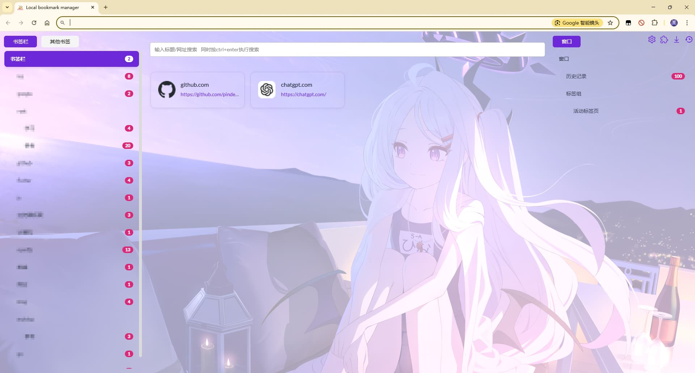

# Local Bookmark Manager

**_Better management of your bookmarks_**

A powerful browser extension that helps you efficiently manage bookmarks, browsing history, and tab groups.

## Features

- **Bookmark Management**: Intuitive tree structure for easy organization and access to your bookmarks
- **History Management**: Quickly find and organize your browsing history
- **Tab Group Management**: Efficiently manage and switch between tab groups
- **Custom Backgrounds**: Support for local uploads and online images/videos as backgrounds
- **Configuration Export/Import**: Easily backup and restore all your settings
- **Multilingual Support**: English, Simplified Chinese, and Traditional Chinese
- **Global Search**: Quickly search bookmarks and browsing history

## Screenshots


## Usage Guide

### Basic Operations

1. **After Installation**:
   - Click the extension icon in the browser toolbar to open the popup window
   - New tabs will display your bookmark management interface

2. **Bookmark Management**:
   - Left and right panels show bookmark tree structures
   - Middle area displays shortcuts and search functionality
   - Right-click on bookmarks or folders for more operations (rename, delete, etc.)
   - Drag and drop bookmarks to adjust positions or move to different folders

3. **Search Function**:
   - Enter keywords in the search box to search bookmarks and history
   - Press Ctrl+Enter for direct web search

4. **Background Settings**:
   - Click the "Update Background" button in the popup window
   - Choose from default backgrounds, upload local images, or use online images/videos

### Advanced Features

1. **Configuration Management**:
   - **Export Configuration**: Save all your settings to a local file
   - **Import Configuration**: Restore settings from previously exported files
   - **Clear Configuration**: Reset all settings to default

2. **History Bookmark Management**:
   - Click "History Bookmark Management" to view and manage history
   - Support for adding, opening, importing, and exporting history bookmark groups

3. **Custom Settings**:
   - Set default search engine (Baidu, Google, or custom)
   - Adjust bookmark drag behavior
   - Enable/disable default right-click menu

## Tech Stack

- **Frontend Framework**: Vue 3 + TSX
- **UI Components**: @opentiny/vue
- **Build Tools**: WXT (Web Extension Tools)
- **Data Storage**: Chrome Storage API + IndexedDB
- **Other Technologies**: Dexie.js, RxJS, Lodash

## Quick Start (Development)

Ensure you have Node.js 20+ and pnpm installed.

```sh
# Install dependencies
pnpm i

# Run in development mode
pnpm run serve

# Build production version
pnpm run build

# Package as zip file (for uploading to extension stores)
pnpm run zip
```

## Browser Compatibility

- **Chrome/Chromium**: Fully supported
- **Firefox**: Some compatibility issues exist
- **Edge**: Theoretically compatible, not fully tested yet

## Contributing

Contributions are welcome! Feel free to contribute code, report issues, or suggest new features through:

1. Fork this repository
2. Create your feature branch (`git checkout -b feature/amazing-feature`)
3. Commit your changes (`git commit -m 'Add some amazing feature'`)
4. Push to the branch (`git push origin feature/amazing-feature`)
5. Open a Pull Request

## Privacy Policy

This extension respects user privacy. All data is stored locally and is not uploaded to any servers. For detailed information, please see the [Privacy Policy](https://github.com/pingnas/Local-bookmark-manager/blob/main/privacy-policy.md).

## License

[MIT](./LICENSE) © pingnas


## Star History

[](https://www.star-history.com/#pingnas/Local-bookmark-manager&Date)